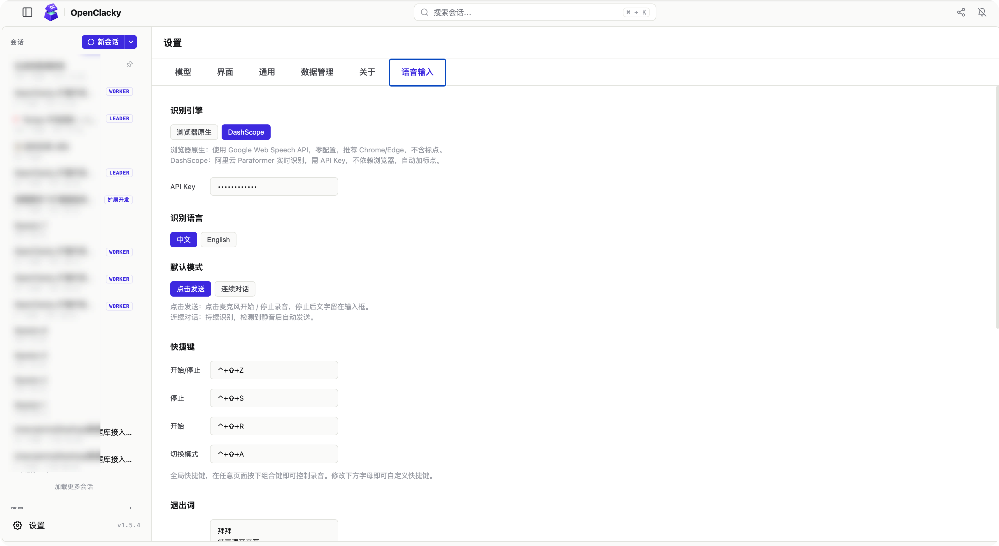

# 语音输入扩展

[English](./docs/README.en.md)

用语音说话，自动转文字填入输入框——支持点击发送和连续对话两种模式，自带可视化设置面板，中英双语界面。

> 📌 **反馈与建议**：欢迎前往 [GitHub 仓库](https://github.com/echohn/openclacky-ext-voice-input) 提 Issue 报告 Bug 或提出功能需求。

---

## 这是什么

这个扩展让你**用嘴说话代替打字**。点击输入框上方的麦克风按钮，实时语音转文字会自动填入聊天输入框，说完了再发送。

核心能力：

- **实时语音识别**——边说边出字，无需等待录音结束
- **两种使用模式**——点击发送（说一段发一段）或连续对话（持续听写、自动发送）
- **全局快捷键**——在任何页面用键盘控制录音，手不离键盘
- **退出词检测**——说出预设词语（如「拜拜」）自动停止录音
- **多会话隔离**——不同对话的语音上下文互不干扰，切换不丢失
- **自定义音效**——录音开始/结束播放提示音，支持自定义音频文件
- **中英双语界面**——跟随 OpenClacky 语言设置自动切换

默认使用浏览器原生语音识别，零配置即用；也可在设置中切换为阿里云 DashScope 引擎获得更好的识别效果（详见下方[引擎对比](#引擎对比)）。

---

## 快速上手

### 第一步：安装扩展

扩展安装后，输入框上方会自动出现一个 **🎤 语音输入** 按钮。

### 第二步：开始录音

点击 **🎤 语音输入** 按钮（或按 `Ctrl+Shift+Z`），按钮变红并显示录音计时器，开始说话。

### 第三步：查看结果

说话时文字实时出现在输入框中。再次点击按钮停止录音，文字保留在输入框，你可以编辑后发送。

### 第四步：切换连续对话（可选）

按 `Ctrl+Shift+M` 切换到连续对话模式，说完一句停顿一下就自动发送，无需反复点击。

---

## 两种使用模式

| 模式 | 说明 | 适用场景 |
|------|------|----------|
| **点击发送** (Push-to-Talk) | 点击麦克风开始录音，再点击停止。停止后文字保留在输入框，可编辑后手动发送。 | 口述长段落、需要修改后再发 |
| **连续对话** (Hands-Free) | 持续识别，检测到停顿后自动将当前句子发送。发完继续听下一句，无需反复点击。 | 连续口述多轮对话、解放双手 |

> 在设置面板中选择默认模式，也可用快捷键 `Ctrl+Shift+M` 随时切换。

---

## 引擎对比

扩展默认使用浏览器原生语音识别引擎，零配置开箱即用。如果需要更好的识别效果，可在设置中切换为阿里云 DashScope 引擎。

| | 浏览器原生（默认） | DashScope |
|---|---|---|
| **配置** | 零配置，开箱即用 | 需申请阿里云 API Key |
| **浏览器要求** | Chrome / Edge（需支持 Web Speech API） | 任意现代浏览器 |
| **标点** | 无标点 | 自动加标点 |
| **中文识别** | 一般 | 优秀 |
| **中英混合** | 一般 | 优秀 |
| **网络依赖** | 依赖 Google 服务 | 依赖阿里云服务 |
| **申请入口** | — | [DashScope 控制台](https://dashscope.console.aliyun.com/) |

> 如果你的浏览器不支持 Web Speech API，输入框上方会出现 `⚠️ 浏览器不支持 -> 切换 DashScope` 提示，点击即可一键切换。

---

## 设置面板

在 OpenClacky 的 **设置** 页面中，点击 **「语音输入」** 标签即可打开设置面板。

> 上图展示了中文环境下的语音输入设置面板，包含识别引擎、识别语言、默认模式、快捷键、退出词、音效、时间参数等配置项。

### 识别引擎

选择语音识别引擎：**浏览器原生** 或 **DashScope**。选择 DashScope 后会出现 API Key 输入框。

- API Key 以脱敏形式回显（如 `sk-a****b7e2`），后端自动验证有效性
- 保存时如果 API Key 无效，面板顶部会弹出黄色警告

### 识别语言

切换中文（`zh-CN`）或英文（`en-US`）识别。

### 默认模式

设置启动时的默认模式：**点击发送** 或 **连续对话**。

### 快捷键

四组全局快捷键，点击输入框后按下新的组合键即可重新绑定：

| 名称 | 默认组合键 | 功能 |
|------|-----------|------|
| 开始/停止 | `Ctrl+Shift+Z` | 切换录音状态 |
| 停止 | `Ctrl+Shift+S` | 仅停止录音 |
| 开始 | `Ctrl+Shift+R` | 仅开始录音 |
| 切换模式 | `Ctrl+Shift+M` | 在「点击发送」和「连续对话」间切换 |

> Mac 上 `Ctrl` 显示为 `⌃`，`Shift` 显示为 `⇧`。快捷键在任意页面全局生效（输入框聚焦时除外）。

### 退出词

设置语音退出词，每行一个。说出任意一个退出词会自动停止录音。

默认退出词：`拜拜`、`结束语音交互`、`退出语音交互`、`关闭语音`、`再见`、`byebye`

> 退出词需与识别语言一致。中文引擎用中文退出词，英文引擎用英文退出词。

### 按钮位置

为了与其他扩展按钮保持一致的显示风格，语音输入按钮默认使用标准样式，用户可通过以下设置适当自定义按钮位置和加载顺序。

控制语音输入按钮在输入框区域内的垂直对齐方式。

| 选项 | 效果 |
|------|------|
| `top` | 按钮靠上对齐 |
| `center` | 按钮居中对齐 |
| `bottom` | 按钮靠下对齐（默认） |

### 加载顺序

当多个扩展同时占用了输入框区域时，通过调整加载顺序可控制各扩展按钮的左右排列顺序。数值越大越靠右显示。如果该区域仅加载了一个扩展，此设置不生效。

- **默认值**：`5`
- 如需让按钮显示在更左侧，可减小该数值；如需更靠右，可增大该数值。
- 修改后需**刷新页面**才能生效。

### 音效

配置录音开始和结束的提示音：

| 值 | 效果 |
|----|------|
| `default` | 内置电子提示音（880Hz 开始 / 440Hz 结束） |
| `none` | 静音，无提示音 |
| 文件名 | 自定义音效，如 `voice-start.mp3` |

自定义音效文件需放入 `~/.clacky/sounds/` 目录。支持 mp3、wav、ogg、aac、m4a、flac、webm 格式。

音量滑块控制提示音大小（0.0 ~ 1.0）。

### 时间参数

| 参数 | 默认值 | 说明 |
|------|--------|------|
| 静音超时 | 1500 ms | 连续对话模式下，说话停顿超过此时长自动发送当前句子 |
| 重连延迟 | 300 ms | 浏览器 ASR 因静音自动停止后，等待此时长再重新开始监听 |

> 静音超时只影响「连续对话」模式。「点击发送」模式不受此设置影响。

---

## 常见问题

### 麦克风按钮显示「浏览器不支持」

你的浏览器不支持 Web Speech API。请切换到 Chrome 或 Edge，或者在设置中将引擎切换为 **DashScope**（不依赖浏览器 API）。

### 麦克风权限被拒绝

在浏览器地址栏点击锁形图标 → 网站设置 → 麦克风 → 允许，然后刷新页面。

### DashScope 提示「API Key 未配置」

前往 **设置 → 语音输入 → 识别引擎** 选择 DashScope，在 API Key 输入框中填入你的阿里云 DashScope API Key。API Key 可在 [阿里云 DashScope 控制台](https://dashscope.console.aliyun.com/) 申请。

### 连续对话模式说话没有自动发送

检查 **静音超时** 设置——如果值太大，需要停顿更久才会触发自动发送。默认 1500ms（1.5秒），可以适当调小。

### 语音识别突然中断

浏览器原生引擎在长时间静音后会自动停止。扩展会自动重新连接（最多重试 3 次）。如果频繁中断，建议切换到 DashScope 引擎，它更稳定。

### 录音时手动修改了输入框文字，会丢失吗？

不会。扩展会检测到你的手动编辑并自动吸收——下次识别结果会在你编辑后的文字后继续追加，不会覆盖。

### 切换会话后语音内容还在吗？

是的。每个会话的语音缓冲区是独立的。切换到另一个会话时，当前会话的上下文自动保存，切回来时恢复。

---

## 使用建议

- **首次使用推荐浏览器原生引擎**。零配置即用，体验 Google Web Speech API 的效果。
- **需要标点符号就切换 DashScope**。浏览器原生引擎不加标点，DashScope 会自动加逗号句号。
- **连续对话模式适合长口述**。开启后持续说话，每说完一句停顿一下就自动发送，无需反复点击。
- **退出词让语音控制更自然**。说完话直接说「拜拜」就停，不用伸手去按按钮。
- **自定义快捷键提升效率**。如果默认组合键与其他工具冲突，在设置中重新绑定即可。
- **静音超时按需调整**。说话节奏慢可以调大（如 2000ms），语速快可以调小（如 1000ms）。
- **API Key 安全无忧**。Key 仅存储在本地配置文件中，前端始终脱敏显示，不会泄露。
